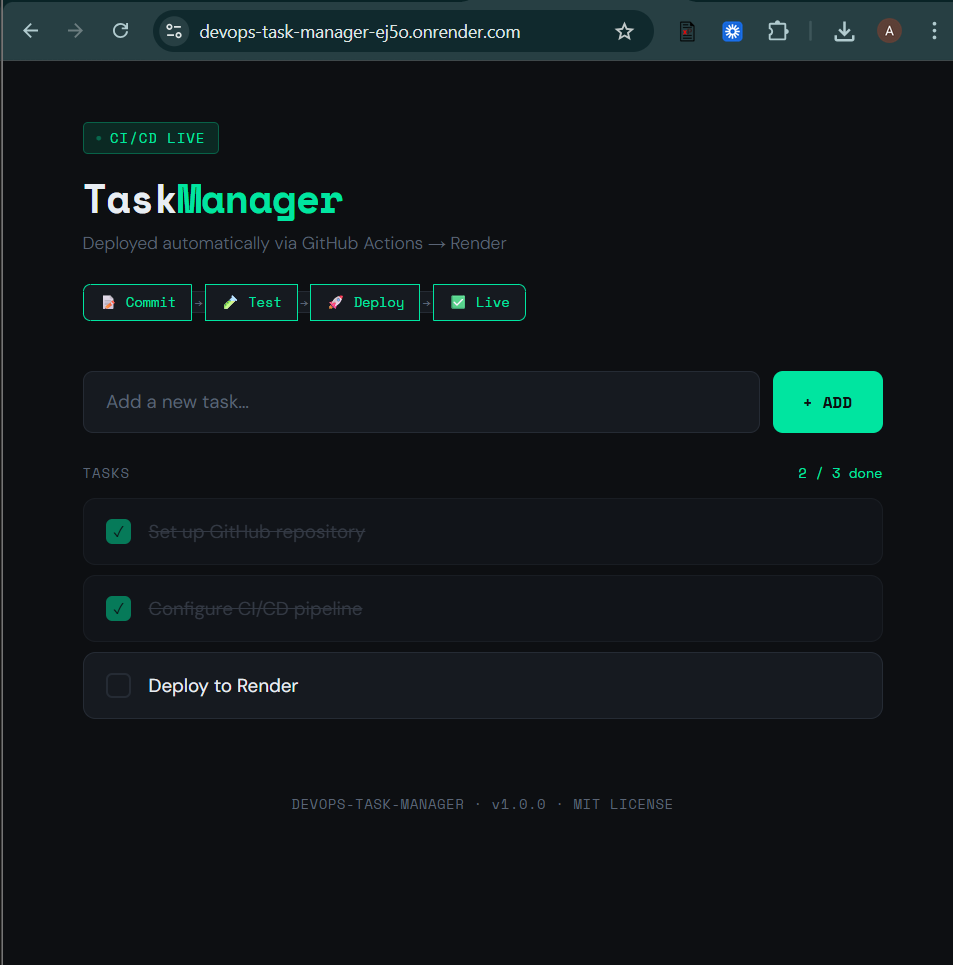

# 🚀 DevOps Task Manager

> A full-stack Node.js application with an automated CI/CD pipeline powered by **GitHub Actions** and deployed to **Render**.

---

## 🌐 Live Application

**[https://devops-task-manager-ej5o.onrender.com/](https://devops-task-manager-ej5o.onrender.com/)**


---

## 📸 Screenshots

### Hosted Application



### GitHub Actions – Successful Pipeline Run


> Add a screenshot of your green Actions run from: `https://github.com/YOUR_USERNAME/YOUR_REPO/actions`

---

## ⚙️ Pipeline Description

The CI/CD pipeline is defined in `.github/workflows/main.yml` and runs automatically on every `push` or `pull_request` to the `main` branch.

### Pipeline Flow

```
Developer pushes code
        │
        ▼
┌───────────────────────────────┐
│  STAGE 1 — CI (Quality Gate)  │
│  ─────────────────────────    │
│  1. Checkout repository       │
│  2. Set up Node.js 20         │
│  3. Install dependencies      │
│  4. Run Jest test suite       │
│     ├── PASS → continue ✅    │
│     └── FAIL → pipeline stops │
└───────────────┬───────────────┘
                │ (only if tests pass)
                ▼
┌───────────────────────────────┐
│  STAGE 2 — CD (Deploy)        │
│  ─────────────────────────    │
│  1. Trigger Render deploy hook│
│  2. Render pulls latest code  │
│  3. Render rebuilds & restarts│
│  4. New version goes live ✅  │
└───────────────────────────────┘
```

### Key Rule
> **If any test fails, the pipeline stops immediately and deployment is blocked.** Broken code can never reach production.

---

## 🧪 Test Suite

The app includes **9 automated tests** written with **Jest** and **Supertest**, covering:

| Endpoint | Scenario | Expected |
|---|---|---|
| `GET /health` | Server is running | `200 OK` |
| `GET /api/tasks` | Fetch all tasks | `200` + array |
| `POST /api/tasks` | Valid title | `201 Created` |
| `POST /api/tasks` | Empty title | `400 Bad Request` |
| `POST /api/tasks` | Missing title | `400 Bad Request` |
| `PATCH /api/tasks/:id` | Toggle task done | `200` + updated task |
| `PATCH /api/tasks/:id` | Non-existent ID | `404 Not Found` |
| `DELETE /api/tasks/:id` | Delete task | `200 OK` |
| `DELETE /api/tasks/:id` | Non-existent ID | `404 Not Found` |

**Run tests locally:**
```bash
npm test
```

---

## 🔄 Update Strategy — Recreate

### Strategy Chosen: **Recreate**

The **Recreate** strategy was chosen because it is the most appropriate strategy for a free-tier hosting environment (Render's free plan). It is simple, reliable, and well-supported.

### How It Works

```
Current version (v1) running
         │
         ▼
  Deploy triggered by CI
         │
         ▼
  Old version (v1) is stopped ❌
         │
         ▼
  New version (v2) starts up ✅
         │
         ▼
  Traffic served from v2
```

### Steps Taken to Implement

1. **Render** automatically uses the Recreate strategy on its free tier — when a new deploy is triggered, the old instance is shut down and replaced with the new one.
2. The GitHub Actions workflow only triggers the deploy hook **after** all tests pass (the `needs: test` dependency in the workflow ensures this ordering).
3. This means that any version reaching production has **already been validated** by the CI stage, making the brief downtime during recreation acceptable.

### Trade-offs

| ✅ Pros | ⚠️ Cons |
|---|---|
| Simple to implement | Brief downtime during deploy |
| No extra infrastructure needed | Not suitable for high-traffic production apps |
| Zero cost on free tier | Old version cannot run in parallel |

> For a higher-traffic application, a **Blue-Green** or **Rolling Update** strategy would be preferred, but these require paid-tier features (multiple instances, load balancers).

---

## ⏪ Rollback Guide

If a bug is discovered in production, follow these steps to revert to the previous stable version.

### Method 1 – Rollback via Render Dashboard (Recommended)

This is the fastest method. Render keeps a history of all previous deploys.

**Step 1:** Go to [https://dashboard.render.com](https://dashboard.render.com) and open your service.

**Step 2:** Click the **"Events"** tab in the left sidebar.

**Step 3:** Find the last **successful** deploy before the broken one.

**Step 4:** Click the **"..."** (three-dot menu) next to that deploy.

**Step 5:** Select **"Rollback to this deploy"**.

**Step 6:** Confirm the rollback. Render will immediately redeploy that exact version.

**Step 7:** Verify the live site is working correctly at your app URL.

⏱️ **Estimated time: ~2 minutes**

---

### Method 2 – Rollback via Git Revert (Permanent Fix)

Use this method when you want to permanently remove the bad code from your history.

```bash
# Step 1: Find the commit hash of the last good version
git log --oneline

# Step 2: Revert the bad commit (creates a new "undo" commit)
git revert <bad-commit-hash>

# Step 3: Push the revert to main — this triggers the CI/CD pipeline
git push origin main

# The pipeline will: run tests → pass → deploy the reverted version
```

> This method is preferred for team environments because it preserves full git history and triggers the full CI/CD pipeline (so the reverted version is also tested before going live).

---

## 🛠️ Local Setup

```bash
# 1. Clone the repository
git clone https://github.com/YOUR_USERNAME/devops-task-manager.git
cd devops-task-manager

# 2. Install dependencies
npm install

# 3. Start the development server
npm start

# 4. Open in browser
open http://localhost:3000

# 5. Run the test suite
npm test
```

---

## 📁 Project Structure

```
devops-task-manager/
├── .github/
│   └── workflows/
│       └── main.yml        ← CI/CD pipeline definition
├── public/
│   └── index.html          ← Frontend UI
├── src/
│   ├── app.js              ← Express app & API routes
│   └── server.js           ← Server entry point
├── tests/
│   └── app.test.js         ← Jest + Supertest test suite
├── .gitignore
├── package.json
└── README.md
```

---

## 🔑 Environment Variables & Secrets

| Variable | Where | Description |
|---|---|---|
| `RENDER_DEPLOY_HOOK_URL` | GitHub Secrets | Your Render deploy hook URL |
| `PORT` | Render (auto) | Port the server listens on |
| `NODE_ENV` | Render (optional) | Set to `production` |

### How to add the Render Deploy Hook to GitHub Secrets

1. In Render dashboard → Your service → **Settings** → **Deploy Hook** → Copy the URL.
2. In GitHub → Your repo → **Settings** → **Secrets and variables** → **Actions** → **New repository secret**.
3. Name: `RENDER_DEPLOY_HOOK_URL`, Value: paste the URL.

---

## 📋 Tech Stack

| Layer | Technology |
|---|---|
| Runtime | Node.js 20 |
| Framework | Express.js |
| Testing | Jest + Supertest |
| CI/CD | GitHub Actions |
| Hosting | Render (free tier) |
| Strategy | Recreate |

---

*Built for the DevOps Workflows assignment — demonstrating automated CI/CD from commit to production.*
