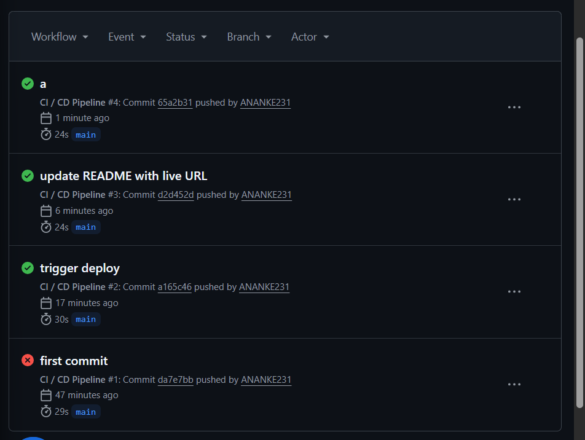

# DevOps Task Manager

A simple task manager app built with Node.js and Express. The main point of this project is setting up a CI/CD pipeline using GitHub Actions that automatically tests and deploys the app to Render.

---

## Live App

**https://devops-task-manager-ej5o.onrender.com/**

---

## Screenshots

### The App


### GitHub Actions Pipeline


---

## How the Pipeline Works

Every time I push code to the `main` branch, GitHub Actions automatically:

1. Installs dependencies
2. Runs all the tests
3. If tests pass → deploys to Render
4. If tests fail → stops and does not deploy

So broken code can never reach the live site.

```
push code → run tests → pass? → deploy
                       → fail? → stop
```

---

## Tests

I wrote 9 tests using Jest and Supertest that cover the main API routes.

```bash
npm test
```

| What is tested | Expected result |
|---|---|
| GET /health | 200 OK |
| GET /api/tasks | returns list |
| POST with valid title | 201 Created |
| POST with empty title | 400 error |
| Toggle task done | updates correctly |
| Delete task | removes from list |
| Wrong ID | 404 error |

---

## Deployment Strategy — Recreate

I used the **Recreate** strategy because Render's free tier only supports one instance at a time.

How it works:
- Old version shuts down
- New version starts up
- Takes about 30 seconds

It's not perfect for big production apps but works fine for this project.

---

## How to Rollback

If something breaks in production:

**Option 1 — Render Dashboard (fastest)**
1. Go to dashboard.render.com
2. Open your service → Events tab
3. Find the last working deploy
4. Click "..." → "Rollback to this deploy"
5. Done, takes about 2 minutes

**Option 2 — Git Revert**
```bash
git log --oneline
git revert <bad-commit-hash>
git push origin main
```
This triggers the pipeline again and deploys the fixed version.

---

## Run Locally

```bash
git clone https://github.com/ANANKE231/devops-task-manager.git
cd devops-task-manager
npm install
npm start
```

Open http://localhost:3000

---

## Tech Stack

- Node.js + Express
- Jest + Supertest (testing)
- GitHub Actions (CI/CD)
- Render (hosting)
